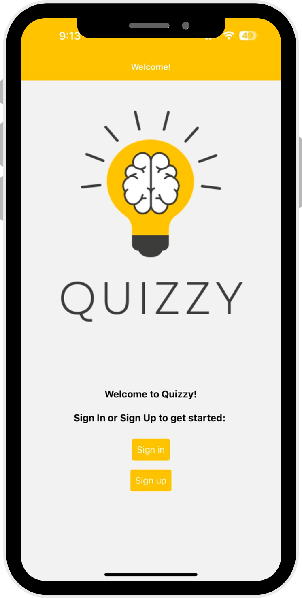
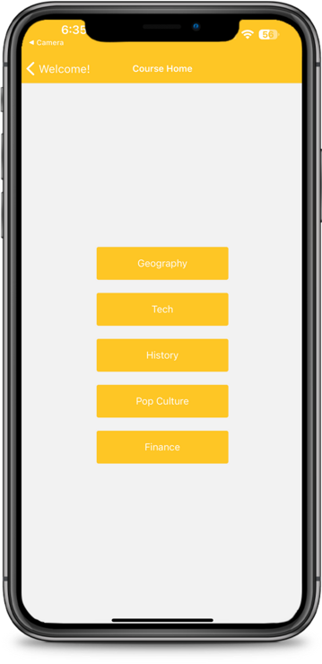

# Quizzy-App

We decided to make a quiz app for our final project. To do this, we chose five different topics and created a question bank for each. The questions range in difficulty and are meant to challenge users. The app is built in React Native and uses Google Firebase for Authentification.

